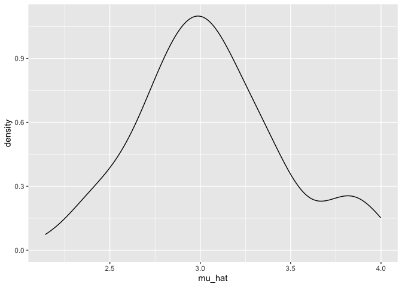
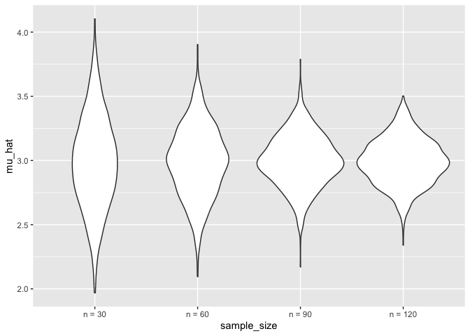
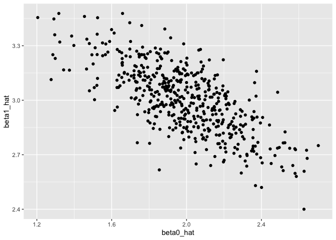

simulation
================
Fenglin Xie
2025-10-30

你想要验证你的方法对不对，run simulation！ define data generating
mechanism which is close to the reality – draw samples over and over
again – do simulation

``` r
library(tidyverse)
```

    ## ── Attaching core tidyverse packages ──────────────────────── tidyverse 2.0.0 ──
    ## ✔ dplyr     1.1.4     ✔ readr     2.1.5
    ## ✔ forcats   1.0.1     ✔ stringr   1.5.2
    ## ✔ ggplot2   4.0.0     ✔ tibble    3.3.0
    ## ✔ lubridate 1.9.4     ✔ tidyr     1.3.1
    ## ✔ purrr     1.1.0     
    ## ── Conflicts ────────────────────────────────────────── tidyverse_conflicts() ──
    ## ✖ dplyr::filter() masks stats::filter()
    ## ✖ dplyr::lag()    masks stats::lag()
    ## ℹ Use the conflicted package (<http://conflicted.r-lib.org/>) to force all conflicts to become errors

``` r
source("source/sim_mean_sd.R")
```

We can “simulate” by running our function

``` r
sim_mean_sd(n_subj = 400)
```

    ## # A tibble: 1 × 2
    ##   mu_hat sigma_hat
    ##    <dbl>     <dbl>
    ## 1   2.96      1.88

Can I “verify” the central limit theorem(大概看一下，而不是严谨证明)

first with a `for` loop

``` r
output = vector("list", length = 100)

for (i in 1:100) {
  
  output[[i]] = sim_mean_sd(30)
  
}

output |> 
  bind_rows() |> 
  ggplot(aes(x = mu_hat)) +
  geom_density()
```

<!-- -->

Try to repeat with a map statement

``` r
sim_results_df =
  expand.grid(
    iter = 1:100,
    sample_size = 30
  ) |> 
  mutate(
    results = map(sample_size, sim_mean_sd)
  ) |> 
  unnest(results)
```

我们想研究–不同的sample size会不会影响结果

\##`expand.grid`combine all the possible combinations of the two
inputs–30的sample size有1000次，同理其他sample size也是1000次

\##一开始做simulation的时候建议从相对较小的数字开始，先确保它确实能运行，之后在把simulation的次数加大

``` r
sim_results_df =
  expand.grid(
    iter = 1:1000,
    sample_size = c(30, 60, 90, 120)
  ) |> 
  mutate(
    results = map(sample_size, sim_mean_sd)
  ) |> 
  unnest(results)
```

Let’s look at this

``` r
sim_results_df |> 
  mutate(
    sample_size = str_c("n = ", sample_size),
    sample_size = fct_inorder(sample_size)
  ) |> 
  ggplot(aes(x = sample_size, y = mu_hat)) +
  geom_violin()
```

<!-- -->

Let’s try to summarize

(iteration的次数越多，the empirical mean of mu_hat越接近true mean, the
empirical sd of mu_hat越接近sd/sqrt(n))

``` r
sim_results_df |> 
  group_by(sample_size) |> 
  summarize(
    emp_mean = mean(mu_hat),
    emp_sd = sd(mu_hat)
  )
```

    ## # A tibble: 4 × 3
    ##   sample_size emp_mean emp_sd
    ##         <dbl>    <dbl>  <dbl>
    ## 1          30     2.98  0.360
    ## 2          60     2.99  0.273
    ## 3          90     3.00  0.203
    ## 4         120     2.99  0.179

Simple linear regression

``` r
##data generating process

sim_df =
  tibble(
    x = rnorm(30, mean = 1, sd = 1),
    y = 2 + 3 * x + rnorm(30, 0, 1)
  )

##draw plot to show it works

sim_df |> 
  ggplot(aes(x = x, y = y)) +
  geom_point()
```

<!-- -->

``` r
slr_fit = lm(y ~ x, data = sim_df)

coef(slr_fit)
```

    ## (Intercept)           x 
    ##    1.513156    3.234815

\##do simulation–how do you simulate data, how do you need to analyze
it, what you are going to send back as the results

turn this into function.

``` r
sim_regression = function(n_subj, beta_0 = 2, beta_1 = 3) {
  
  sim_df =
    tibble(
      x = rnorm(n_subj, mean = 1, sd = 1),
      y = beta_0 + beta_1 * x + rnorm(30, 0, 1)
    )

  slr_fit = lm(y ~ x, data = sim_df)

  tibble(
    beta0_hat = coef(slr_fit)[1],
    beta1_hat = coef(slr_fit)[2]
  )

}
```

``` r
sim_regression(n_subj = 30)
```

    ## # A tibble: 1 × 2
    ##   beta0_hat beta1_hat
    ##       <dbl>     <dbl>
    ## 1      2.18      2.99

不想手动点击生成，直接使用`for`loop一次性生成大量结果

``` r
output = vector("list", length = 500)

for (i in 1:500) {
  
  output[[i]] = sim_regression(n_subj = 30)
  
}

output |> 
  bind_rows()
```

    ## # A tibble: 500 × 2
    ##    beta0_hat beta1_hat
    ##        <dbl>     <dbl>
    ##  1      1.91      2.98
    ##  2      2.19      3.05
    ##  3      1.34      3.28
    ##  4      2.02      2.91
    ##  5      2.12      2.81
    ##  6      1.71      2.96
    ##  7      2.05      3.01
    ##  8      2.22      2.97
    ##  9      2.15      2.77
    ## 10      1.85      3.05
    ## # ℹ 490 more rows

\##我们设定每次的sample size都是30，但现实中每次获得的sample size
可能都不同，定义不同的sample size即可

``` r
slr_sim_results_df =
  expand_grid(
    sample_size = 30,
    iter = 1:500
  ) |> 
  mutate(
    results = map(sample_size, sim_regression)
  ) |> 
  unnest(results)

slr_sim_results_df |> 
  ggplot(aes(x = beta0_hat, y = beta1_hat)) +
  geom_point()
```

<!-- -->

## One more example

生日问题–一个房间里的人，至少有两个同一天生日

what I am sampling from(1:365),how many sample am I taking(5),
数据可以重复出现（replace = TRUE）–
取样：从1到365中选5个数字，每个数字可以被重复选取

``` r
##data generating mechanism 
birthdays = sample(1:365, 5, replace = TRUE)
```

独有的生日个数是否小于5

``` r
##analysis
repeated_bday = length(unique(birthdays)) < 5

##return the results
repeated_bday
```

    ## [1] FALSE

put this in a function

``` r
bday_sim = function(n_room) {
  
  birthdays = sample(1:365, n_room, replace = TRUE)
  
  repeated_bday = length(unique(birthdays)) < n_room
  
  repeated_bday
  
}

bday_sim(5)
```

    ## [1] FALSE

\##如果我知道结果是以true/false的形式展现，那我直接使用`map_lgl`,这样就会直接展示结果，而不是奇怪的数据形式

\##为啥是bdays放在map中？？不应该是n_room吗？？

``` r
bday_sim_results =
  expand_grid(
    bdays = 5:50,
    iter = 1:2500
  ) |> 
  mutate(
    result = map_lgl(bdays, bday_sim)
  ) |> 
  group_by(
    bdays
  ) |> 
  summarize(
    prob_repeat = mean(result)
  )
```

plot this

``` r
bday_sim_results |> 
  ggplot(aes(x = bdays, y = prob_repeat)) +
  geom_point() +
  geom_line()
```

<!-- -->
